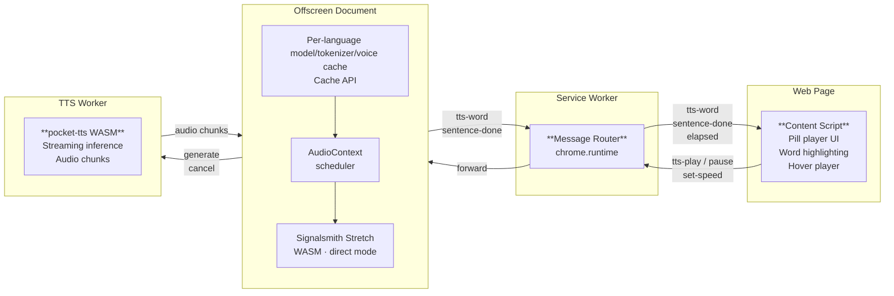

# Pocket Speechify

[](https://github.com/damageboy/pocket-speechify/actions/workflows/release.yml)
[](https://github.com/damageboy/pocket-speechify/releases/latest)
[](https://github.com/damageboy/pocket-speechify/releases/latest)

A lightweight Chrome extension that replicates the Speechify text-to-speech UI — floating pill player, word highlighting, and voice selection — powered by the multilingual pocket-tts v2.1.0 WASM model running entirely in your browser.

---

## Features

- **Floating pill player** — fixed to the right edge of any page, draggable, collapses when not in use
- **Word-level highlighting** — sentence and word highlights track playback in real time
- **Pitch-preserving speed control** — 0.4x to 4.5x via [Signalsmith Stretch](https://github.com/Signalsmith-Audio/signalsmith-stretch) WASM; pitch stays natural at any speed
- **Multilingual pocket-tts v2.1.0 support** — English, German, Italian, Portuguese, Spanish, and French preview voices
- **Automatic language detection** — reads page metadata (`lang`, `og:locale`, and language meta tags) and supports saved domain language overrides
- **Hover-to-play** — hover over any paragraph to start reading from there
- **Scroll-to-highlight** — floating nav pill snaps you back to the word being read
- **Fully offline after first use per language** — model, tokenizer, and voice assets download on demand and are cached locally with the Cache API
- **Memory-conscious loading** — only one language model is loaded into memory at a time
- **No API keys, no accounts, no telemetry**

---

## Installation

### From a release (recommended)

1. Download the latest `.zip` from [Releases](https://github.com/damageboy/pocket-speechify/releases/latest)
2. Unzip it
3. Open `chrome://extensions`, enable **Developer mode**
4. Click **Load unpacked** and select the unzipped folder

> **Note:** The `.crx` file in releases is self-signed and Chrome will refuse to install it directly. Use the `.zip` + Load unpacked method above.

### From source

```bash
git clone https://github.com/damageboy/pocket-speechify.git
cd pocket-speechify
```

Pocket-tts WASM artifacts are generated into `public/wasm/` and are not checked into git. They are built on demand if missing:

```bash
# Requires Rust + wasm-pack
npm run build:wasm
```

Then load the directory as an unpacked extension.

---

## Usage

1. Navigate to any article or page with readable text
2. The pill player appears on the right edge — click **▶** to start reading
3. The extension reads the page paragraph by paragraph, highlighting the current sentence and word
4. On first use for a language, the model and tokenizer download automatically (around 100MB per language)
5. Voices download on first selection and are cached with the per-language model/tokenizer assets via the Cache API

### Controls

| Control                  | Action                                                                      |
| ------------------------ | --------------------------------------------------------------------------- |
| **▶ / ⏸**                | Play / Pause                                                                |
| **⏭ / ⏮**              | Skip forward / backward one sentence                                        |
| **Speed button**         | Open speed panel (0.4x–4.5x, pitch-preserved)                               |
| **Voice button**         | Open voice selector                                                         |
| **Hover over paragraph** | Shows play button to start from that paragraph                              |
| **Scroll-nav pill**      | Appears when you scroll away from the highlighted text — click to jump back |

---

## Architecture



- **Content script** — injects the pill player UI into pages via shadow DOM, handles highlighting
- **Service worker** — routes messages between content script and offscreen document
- **Offscreen document** — owns all audio: detects the selected language, downloads per-language model/tokenizer/voice assets, keeps only one model loaded at a time, runs the scheduler, and applies pitch-preserving time-stretching via Signalsmith Stretch WASM
- **TTS worker** — runs pocket-tts WASM inference in a Web Worker; streams audio chunks back

### Speed control

Speed changes are pitch-preserving. The offscreen document uses [Signalsmith Stretch](https://github.com/Signalsmith-Audio/signalsmith-stretch) in direct WASM mode — each audio chunk is time-stretched to `outputLen = inputLen / speed` samples via the STFT engine, then scheduled for playback at 1.0x. Pitch is preserved by the algorithm itself, not by pitch-shifting compensation.

---

## Development

### Pre-commit hooks

The repo uses pre-commit hooks that verify the extension build on every commit:

```bash
pip install pre-commit
pre-commit install
```

### Build scripts

| Script                     | Purpose                                    |
| -------------------------- | ------------------------------------------ |
| `scripts/build-wasm.sh`    | Build pocket-tts WASM from source          |
| `scripts/verify-build.sh`  | Check all required files are present       |
| `scripts/stamp-version.sh` | Stamp `manifest.json` version from git tag |
| `scripts/package.sh`       | Create `.zip` for Chrome Web Store         |

#### Building WASM from a local pocket-tts checkout

By default `build-wasm.sh` clones `damageboy/pocket-tts`, the pocket-tts v2.1.0 multilingual fork, from GitHub into a temp directory. `npm run build`, `npm run zip`, and `scripts/verify-build.sh` reuse existing `public/wasm/` artifacts and only run `build-wasm.sh` when they are missing. Set `POCKET_TTS_REPO` to point at a local checkout instead — useful when iterating on the TTS engine without publishing a new release:

```bash
# One-off
POCKET_TTS_REPO=~/projects/pocket-tts npm run build:wasm

# Or export for the whole shell session
export POCKET_TTS_REPO=~/projects/pocket-tts
npm run build:wasm
```

The local repo is **never modified** — only read from. The temp staging directory for WASM artifacts is still created and cleaned up as usual.

### CI

Every push to `master` runs the build workflow and uploads a build artifact. CI starts from a fresh checkout where generated WASM artifacts are absent, so it builds pocket-tts WASM before packaging. Tagged pushes (`v*`) additionally create a GitHub Release with `.zip` and `.crx` attachments.

---

## Credits

- [Kyutai](https://kyutai.org/) — original [pocket-tts](https://huggingface.co/kyutai/pocket-tts-without-voice-cloning) WASM TTS model
- [damageboy/pocket-tts](https://github.com/damageboy/pocket-tts) — pocket-tts v2.1.0 multilingual fork used by the extension build
- [Signalsmith Audio](https://signalsmith-audio.co.uk/) — [Signalsmith Stretch](https://github.com/Signalsmith-Audio/signalsmith-stretch) pitch-preserving time stretching
- [Speechify](https://speechify.com/) — UI/UX reference
