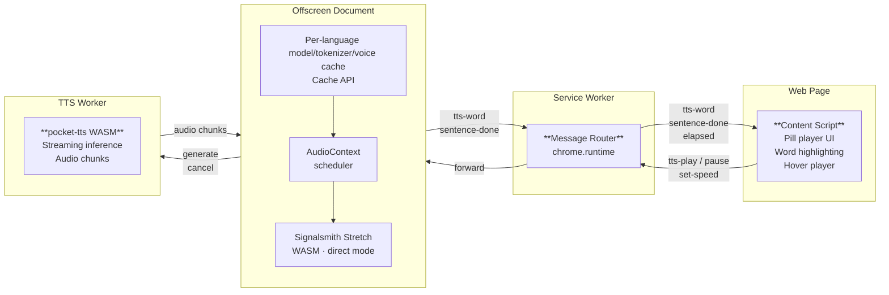

# Pocket Speechify

[](https://github.com/damageboy/pocket-speechify/actions/workflows/release.yml)
[](https://github.com/damageboy/pocket-speechify/releases/latest)
[](https://github.com/damageboy/pocket-speechify/releases/latest)

A lightweight Chrome extension that replicates the Speechify text-to-speech UI — floating pill player, word highlighting, and voice selection — powered by a prebuilt pocket-tts v3.3.0-based WASM engine running entirely in your browser.

---

## Features

- **Floating pill player** — fixed to the right edge of any page, draggable, collapses when not in use
- **Timestamp-based word highlighting** — pocket-tts word-start/end events follow the audio playback clock, including pauses and speed changes; no estimated word timings
- **Pitch-preserving speed control** — 0.4x to 4.5x via [Signalsmith Stretch](https://github.com/Signalsmith-Audio/signalsmith-stretch) WASM; pitch stays natural at any speed
- **Upstream model catalog** — English, German, Italian, Portuguese, Spanish, French, and Dutch, including dated English releases and 24-layer variants
- **Automatic language detection** — uses Chrome's text-language detector on readable article content, with page metadata as a fallback and manual selection for the current page
- **Per-language speech preferences** — remembers a separate model, voice, and playback speed for each language, restoring them across language switches, reloads, and tabs
- **Hover-to-play** — hover over any paragraph to start reading from there
- **Scroll-to-highlight** — floating nav pill snaps you back to the word being read
- **Fully offline after first use per language** — model, tokenizer, and voice assets download on demand and are cached locally with the Cache API
- **Memory-conscious loading** — only one language model is loaded into memory at a time
- **No API keys, no accounts, no telemetry**

---

## Installation

### From a release (recommended)

1. Download the latest `.zip` from [Releases](https://github.com/damageboy/pocket-speechify/releases/latest)
2. Unzip it
3. Open `chrome://extensions`, enable **Developer mode**
4. Click **Load unpacked** and select the unzipped folder

> **Note:** The `.crx` file in releases is self-signed and Chrome will refuse to install it directly. Use the `.zip` + Load unpacked method above.

### From source

```bash
git clone https://github.com/damageboy/pocket-speechify.git
cd pocket-speechify
```

Pocket-tts WASM binaries are downloaded into `public/wasm/` and are not checked into git. A generated upstream `models.json` snapshot is vendored alongside them and refreshed from the same release package on installation. Missing artifacts are installed on demand without a Rust toolchain or GitHub account:

```bash
# Requires Node.js, curl, tar, and shasum
npm ci
npm run build:wasm
npm run build
```

Then load `.output/chrome-mv3/` as an unpacked extension. After updating the WASM pin in an existing checkout, run `npm run build:wasm` explicitly to replace the cached JS, WASM, and catalog together before rebuilding.

---

## Usage

1. Navigate to any article or page with readable text
2. The pill player appears on the right edge — click **▶** to start reading
3. The extension reads the page paragraph by paragraph, highlighting the current paragraph and word with native DOM ranges that follow layout and scrolling
4. On first use for a model, its weights and tokenizer download automatically; larger 24-layer models require more download space and memory
5. Voices download on first selection and are cached with the model/tokenizer assets via the Cache API. An upstream asset revision triggers a fresh download rather than reusing incompatible cached bytes

Page content refreshes as the DOM changes. Playback keeps its original queue through insertions; editing, removing, or reordering remaining queued text stops playback rather than highlighting unrelated text. Start again to read the updated content. Starting playback in another tab supersedes the previous tab.

### Text preprocessing

Open **Settings → Text rules** to edit the ordered regex replacement table. Defaults remove soft hyphens, normalize non-breaking spaces, and collapse whitespace. Add, remove, enable/disable, or reorder rules, then click **Save rules**. Rules are stored locally, apply to all sites and languages, and take effect on the next paragraph submitted (already-generated audio does not change). Removing every rule disables preprocessing.

Patterns use JavaScript regex syntax without surrounding slashes. Flags support `g`, `i`, `m`, `s`, and `u`; replacements support capture references such as `$1` and `$<name>`, `$&` for the full match, and `$$` for a literal dollar sign. Empty replacements remove matches. For example, `\bDr\.` with flags `g` and replacement `Doctor` expands an English title. Keep custom patterns simple: syntax validation does not detect expensive backtracking.

**Settings → History** shows the exact processed text submitted to the engine, one entry per paragraph, after trimming to the playback start position. Original page text stays unchanged. Fully removed paragraphs are skipped without submitting empty text to the engine.

### Controls

| Control                  | Action                                                                      |
| ------------------------ | --------------------------------------------------------------------------- |
| **▶ / ⏸**                | Play / Pause                                                                |
| **⏭ / ⏮**              | Skip forward / backward one sentence                                        |
| **Speed button**         | Open speed panel (0.4x–4.5x, pitch-preserved)                               |
| **Voice button**         | Open voice selector                                                         |
| **Hover over paragraph** | Shows play button to start from that paragraph                              |
| **Scroll-nav pill**      | Appears when you scroll away from the highlighted text — click to jump back |

---

## Architecture


```mermaid
flowchart LR
    subgraph Page["Web Page"]
        CS["**Content Script**\nPill player UI\nWord highlighting\nHover player"]
    end

    subgraph SW["Service Worker"]
        SWR["**Message Router**\nchrome.runtime"]
    end

    subgraph OD["Offscreen Document"]
        Cache["Per-language model/tokenizer/voice cache\nCache API"]
        Sched["AudioContext\nscheduler"]
        Stretch["Signalsmith Stretch\nWASM · direct mode"]
        Cache --> Sched
        Sched --> Stretch
    end

    subgraph TW["TTS Worker"]
        WASM["**pocket-tts WASM**\nStreaming inference\nAudio chunks"]
    end

    CS -- "tts-play / pause\nset-speed" --> SWR
    SWR -- "tts-word\nsentence-done\nelapsed" --> CS

    SWR -- "forward" --> OD
    OD -- "tts-word\nsentence-done" --> SWR

    OD -- "generate\ncancel" --> TW
    TW -- "audio chunks" --> OD
```

- **Content script** — injects the pill player UI into pages via shadow DOM, handles highlighting
- **Service worker** — routes messages between content script and offscreen document
- **Offscreen document** — owns all audio: detects the selected language, downloads per-language model/tokenizer/voice assets, keeps only one model loaded at a time, runs the scheduler, and applies pitch-preserving time-stretching via Signalsmith Stretch WASM
- **TTS worker** — runs pocket-tts WASM inference in a Web Worker; streams audio chunks back

### Speed control

Speed changes are pitch-preserving. The offscreen document uses [Signalsmith Stretch](https://github.com/Signalsmith-Audio/signalsmith-stretch) in direct WASM mode — each audio chunk is time-stretched to `outputLen = inputLen / speed` samples via the STFT engine, then scheduled for playback at 1.0x. Pitch is preserved by the algorithm itself, not by pitch-shifting compensation.

### Word timestamps

The worker uses `start_stream_with_timestamps()` and `next_batch()` for models with calibrated `timestamp_heads`. The offscreen document maps native source-audio timestamps through each scheduled chunk's stretch ratio and the stretcher's input/output latency. It processes metadata-only final batches and waits for all queued audio, including the flushed tail, before advancing paragraphs.

Text rules run before submission to pocket-tts, retaining source offsets through replacements. Lexical indices and spelling are matched against the processed text, then mapped to original page words. Captures retain their original positions; literal replacement words highlight the first matched page word, and zero-width insertions have no page highlight. There is no automatic language-specific abbreviation/number expansion. Native boundaries are approximate (about 80 ms); ambiguous or unspoken words remain unhighlighted.

All six English variants plus Dutch, German, Portuguese, and Spanish **24-layer** models currently support timestamps. Other catalog models retain audio playback without word highlighting. The duration/progress display still estimates unread audio; those estimates do not drive highlighting.

---

## Development

### Pre-commit hooks

The repo uses pre-commit hooks that verify the extension build on every commit:

```bash
pip install pre-commit
pre-commit install
```

### Build scripts

| Script                     | Purpose                                    |
| -------------------------- | ------------------------------------------ |
| `scripts/build-wasm.sh`    | Download pinned WASM (or build a source override) |
| `scripts/verify-build.sh`  | Check all required files are present       |
| `scripts/stamp-version.sh` | Stamp `manifest.json` version from git tag |
| `scripts/package.sh`       | Create `.zip` for Chrome Web Store         |

#### Prebuilt WASM and source overrides

By default `build-wasm.sh` downloads `pocket-tts-v3.3.0-wasm-web.tar.gz` from the republished public [v3.3.0 release](https://github.com/damageboy/pocket-tts/releases/tag/v3.3.0), built from [commit 1e0500d](https://github.com/damageboy/pocket-tts/commit/1e0500de641338ba2c87f609ff47f7a10006f60f). It verifies the pinned SHA-256 checksum and catalog schema before installing `pocket_tts.js`, `pocket_tts_bg.wasm`, and `models.json` together. This is a release asset, not an expiring Actions artifact; no authentication is required. Download, checksum, or catalog validation failures stop the build before replacing the installed files rather than silently switching source versions.

The catalog is generated upstream from pocket-tts's model definitions, original YAML configs, and voice metadata. The extension consumes its model choices, default voices, and pinned Hugging Face URLs without maintaining another model list. It currently supplies 18 models and 27 voices; the default English model uses the September 2026 weights and JSON tokenizer. The extension does not fetch a changing catalog at runtime, so offline use and engine/config compatibility are preserved.

**Catalog packaging:** every release installation takes the catalog from the same archive as the engine. Future package upgrades therefore bring their matching model list automatically. Do not edit the generated snapshot by hand.

`npm run build`, `npm run package`, and `scripts/verify-build.sh` reuse existing `public/wasm/` artifacts and invoke the installer when any of the three files is missing.

Source builds remain available with Bun, Rust, and wasm-pack. They generate the catalog from that checkout, which must include the upstream catalog generator:

```bash
# Build from a local checkout instead of cloning. The checkout is read-only.
POCKET_TTS_DIR=~/projects/pocket-tts npm run build:wasm

# Build the exact source revision used by the republished v3.3.0 release.
POCKET_TTS_REF=1e0500de641338ba2c87f609ff47f7a10006f60f npm run build:wasm
```

`POCKET_TTS_REPO` remains supported as a backwards-compatible alias for `POCKET_TTS_DIR`. The local repo is **never modified** — only read from. The temp staging directory for WASM artifacts is still created and cleaned up as usual.

### CI

Every push to `master` runs the build workflow and uploads a build artifact. CI downloads and verifies the public pinned WASM release before packaging; neither Rust nor a download token is required. Tagged pushes (`v*`) additionally create a GitHub Release with `.zip` and `.crx` attachments.

---

## Credits

- [Kyutai](https://kyutai.org/) — original [pocket-tts](https://huggingface.co/kyutai/pocket-tts-without-voice-cloning) WASM TTS model
- [damageboy/pocket-tts](https://github.com/damageboy/pocket-tts) — multilingual Rust engine and prebuilt WASM package
- [Signalsmith Audio](https://signalsmith-audio.co.uk/) — [Signalsmith Stretch](https://github.com/Signalsmith-Audio/signalsmith-stretch) pitch-preserving time stretching
- [Speechify](https://speechify.com/) — UI/UX reference
